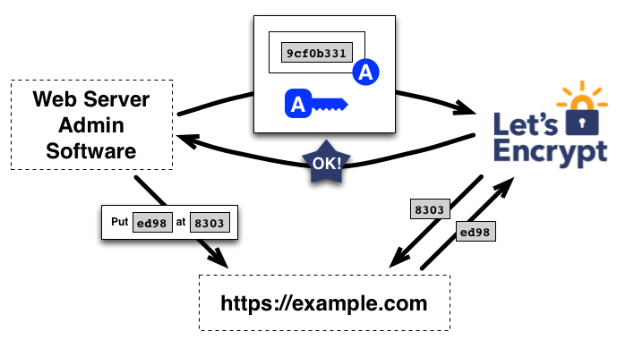
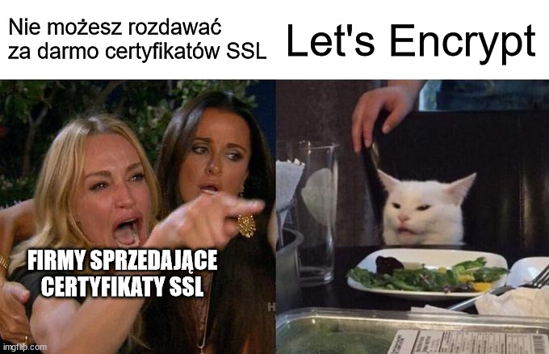
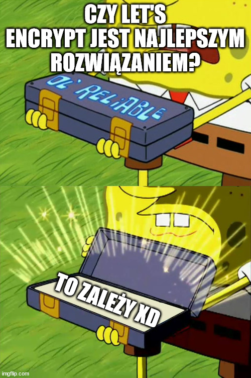
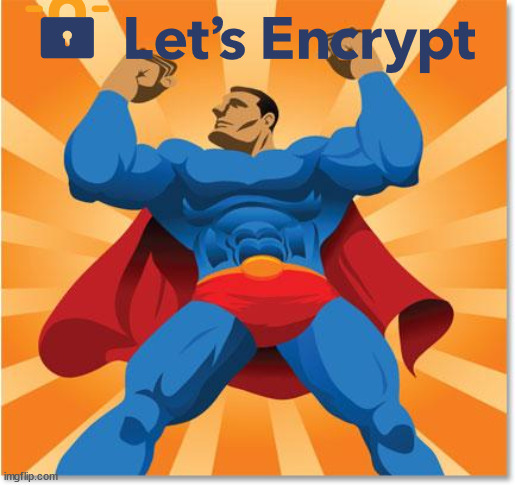
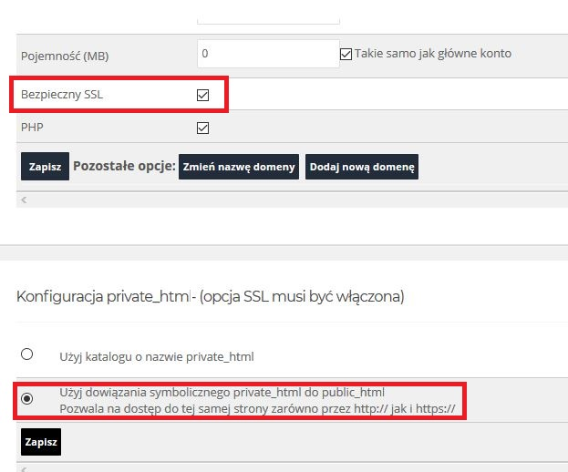
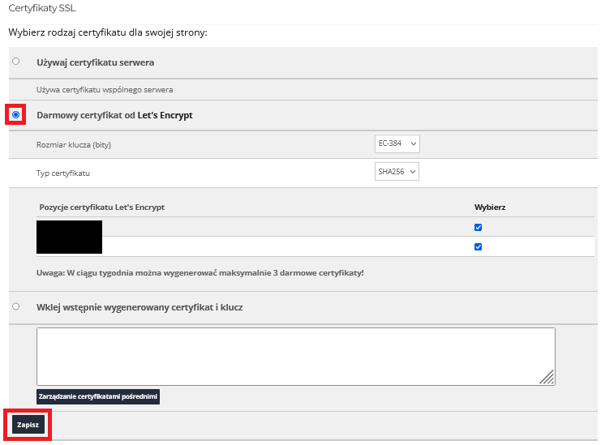

# Temat 3: Instalacja i aktualizacja certyfikatu Let’s Encrypt dla serwera WWW

Stanisław Nieradko 193044, Filip Dawidowski 193433, Bartłomiej Krawisz 193319, Krzysztof Nasuta 193328

---

# Czym jest Let's Encrypt?



> Let’s Encrypt to bezpłatny, automatyczny i wolny urząd certyfikacji (CA) działający dla pożytku publicznego. Jest to usługa dostarczana przez Internet Security Research Group (ISRG).
>
> Zapewniamy wszystkim osobom cyfrowe certyfikaty, których oczekują, aby umożliwić korzystanie stronom internetowym z HTTPS (SSL/TLS) całkowicie bezpłatnie i w jak najbardziej przyjazny dla użytkownika sposób. Czynimy to, ponieważ chcemy stworzyć bezpieczniejszy i szanujący prywatność Internet.
>
> Źródło: <cite>https://letsencrypt.org/pl/about/</cite>

note: Stachu

|||

# Zasady funkcjonowania fundacji Let's Encrypt

- **Bezpłatnie**: Każdy właściciel domeny może użyć Let’s Encrypt do uzyskania zaufanego certyfikatu bez żadnych opłat.
- **Automatycznie**: Oprogramowanie działające na serwerze może bezproblemowo wchodzić w interakcję z Let’s Encrypt, aby uzyskać certyfikat, bezpiecznie skonfigurować go do użytku oraz automatycznie zająć się odnowieniem. 
- **Bezpiecznie**: Let’s Encrypt spełnia funkcję platformy do doskonalenia najlepszych praktyk zabezpieczeń TLS, zarówno po stronie CA, jak i pomagając operatorom witryn poprawnie zabezpieczyć swoje serwery.
- **Otwarcie**: Wszystkie wydane lub cofnięte certyfikaty będą publicznie rejestrowane i dostępne dla każdego do wglądu.
- **Wolnie**: Protokół automatycznego wydawania oraz odnawiania jest opublikowany jako wolny standard, który każdy może zastosować.
- **Wspólnie**: Tak jak podstawowe protokoły internetowe, Let’s Encrypt to wspólny wysiłek na rzecz społeczności pozostający poza kontrolą jakiejkolwiek organizacji.

note: Stachu

|||



note: Stachu

---

## Autoryzacja domeny

- Przy generowaniu certyfikatu Let's Encrypt wymagane jest potwierdzenie, że domena, dla której certyfikat chcemy wygenerować, należy do nas. Możliwe jest to poprzez spełnienie jednego z warunków opisanych w standardzie ACME (Automated Certificate Management Environment). Obecnie wspierane są trzy metody autoryzacji.

| Identyfikator    | `http-01` | `dns-01` | `tls-alpn-01` |
| ---------------- | --------- | -------- | ------------- |
| Adres IP         | ✔️        | ❌      | ✔️            |
| Nazwa hosta      | ✔️        | ✔️      | ✔️            |
| Obsługa wildcard | ❌        | ✔️      | ❌            |

- Obecnie najczęściej stosowanymi metodami są `http-01` oraz `dns-01`.

- Do generowania certyfikatów **Let's Encrypt** często używa się narzędzia **Certbot**. Jest to narzędzie, które automatyzuje proces generowania certyfikatów, a także ich odnawiania. Certbot wspiera zarówno autoryzację `http-01`, jak i `dns-01`.

note: Nasus

|||

## HTTP-01 challenge

- Metoda ta jest obecnie najczęściej stosowaną metodą autoryzacji. Polega na umieszczeniu **pliku z wygenerowanym przez Let's Encrypt kodem** w odpowiednim katalogu **na serwerze**, który jest dostępny z zewnątrz.

- Let's Encrypt sprawdza, czy plik jest dostępny pod adresem `http://<TWOJA_DOMENA>/.well-known/acme-challenge/<TOKEN>`. Jeśli serwer WWW zwróci odpowiedni kod, jest to potwierdzenie, że domena należy do osoby, która chce wygenerować certyfikat.

- Metoda `HTTP-01` wymaga użycia **portu 80** na serwerze, na którym chcemy wygenerować certyfikat.

- Metoda ta jest **prosta w implementacji oraz szybka**, gdyż nie wymaga żadnych dodatkowych konfiguracji DNS. Potrzebujemy jednak dostępu do serwera HTTP obsługującego naszą domenę.

- Metody tej **nie można** użyć, aby wygenerować certyfikat **wildcard**. W przypadku kilku serwerów, każdy z nich musi zwracać ten sam kod.

note: Nasus

|||

## DNS-01 challenge

- Metoda ta polega na **dodaniu rekordu TXT** do DNS domeny, dla której chcemy wygenerować certyfikat. Rekord ten zawiera, podobnie jak w przypadku `HTTP-01`, **wygenerowany przez Let's Encrypt kod**.

- Let's Encrypt sprawdza, czy rekord TXT `_acme-challenge.<TWOJA_DOMENA>` zawiera odpowiedni kod. Jeśli tak jest, mamy potwierdzenie, że domena należy do osoby, która chce wygenerować certyfikat.

- Metoda `DNS-01` wymaga dostępu do **konfiguracji DNS** domeny, dla której chcemy wygenerować certyfikat. Utrudnia to automatyzację procesu generowania certyfikatów. Dostawca DNS musi udostępniać odpowiednie **API**. Zalecane jest używanie uwierzytelniania API o ograniczonych uprawnieniach bądź walidacja DNS z osobnego serwera, a następnie skopiowanie certyfikatu na serwer.

- Metoda ta jest wolniejsza od `HTTP-01`, gdyż wymaga **czasu propagacji rekordów DNS**. Jest to jednak jedyna metoda, która **pozwala** na generowanie certyfikatów **wildcard**. W przypadku kilku serwerów, wystarczy jedna konfiguracja DNS.

note: Nasus

|||

## TLS-SNI-01 challenge

- Do 2019 roku jedną z metod autoryzacji był `TLS-SNI-01`. Polegała ona na **przekazaniu przez Let's Encrypt serwerowi** specjalnego zapytania TLS, które zawierało **wygenerowany przez Let's Encrypt kod**. Serwer musiał zwrócić ten sam kod, aby potwierdzić, że domena należy do osoby, która chce wygenerować certyfikat.

- Metoda została wycofana z użycia w 2019 roku i zastąpiona przez `TLS-ALPN-01` z powodu niewystarczającego poziomu bezpieczeństwa.


note: Nasus

|||

## TLS-ALPN-01 challenge

- Polega na **przekazaniu przez Let's Encrypt serwerowi** specjalnego zapytania TLS, które zawiera **wygenerowany przez Let's Encrypt kod**. Serwer musi zwrócić ten sam kod, aby potwierdzić, że domena należy do osoby, która chce wygenerować certyfikat.

- Metoda ta jest rzadko stosowana. Nie jest obsługiwana przez Apache, Nginx ani Certbot. Jednym z nielicznych narzędzi, które wspierają tę metodę, jest Caddy.

- Zaletą tej metody jest brak konieczności dostępu do portu 80. Cały proces odbywa się na warstwie TLS.

- Metoda ta, podobnie jak `HTTP-01`, **nie pozwala** na generowanie certyfikatów **wildcard**. W przypadku kilku serwerów, każdy z nich musi zwracać ten sam kod.

note: Nasus

---

# Środowiska

Z uwagi na ograniczenia nałożone przez organizację Let's Encrypt, zaleca się używanie certyfikatów wystawionych w środowisku testowym do testowania automatyzacji procesu generowania certyfikatów.

<br />
<br />

<div style="display: grid; grid-template-columns: 1fr 1fr; font-size: 24pt;">

<div>  <!-- .element: class="fragment fade-in" data-fragment-index="1" -->

## Staging

- Certyfikaty wystawione w środowisku testowym są podpisane przez inny certyfikat root, co sprawia, że nie są one uznawane przez przeglądarki internetowe.

- Wystawianie certyfikatów w tym środowisku podlega niższym limitom, co pozwala na testowanie automatyzacji procesu wystawiania certyfikatów, bez dużego ryzyka zablokowania dostępu do usługi Let's Encrypt z powodu przekroczenia ograniczeń.

- W przypadku użycia certbot, aby wygenerować certyfikat staging wystarczy dodać flagę <br />`--staging`.

</div>

<div>  <!-- .element: class="fragment fade-in" data-fragment-index="2" -->

## Prod

- Środowisko produkcyjne to środowisko aplikacji dla użytkowników końcowych. Certyfikaty wystawione w tym środowisku są uznawane przez przeglądarki internetowe.

- Wystawianie certyfikatów w środowisku produkcyjnym podlega limitom nałożonym przez organizację Let's Encrypt takimi jak ilość certyfikatów na zarejestrowaną domenę lub ilość zamówień certyfikatów na godzinę. W przypadku przekroczenia limitów, dostęp do usługi może zostać zablokowany na określony czas.

- Certbot domyślnie generuje certyfikaty w środowisku produkcyjnym.

</div>

</div>

note: Filip

---

# Czy jest to rozwiązanie doskonałe?

 <!-- .element: class="fragment" data-fragment-index="1" -->
note: Stachu
|||

# Dostępne rozwiązania

<div style="display: flex; font-size: 30pt">

<div> <!-- .element: class="fragment fade-in" data-fragment-index="1" -->

## Let's Encrypt

- Darmowe certyfikaty (90 dni)
- Automatyczne odnawianie (certbot, caddy i inne narzędzia)
- Wsparcie dla wildcardów (tylko DNS-01)
- Duża społeczność i wsparcie

</div>

<div> <!-- .element: class="fragment fade-in" data-fragment-index="2" -->

## Płatne certyfikaty

- Dłuższy termin ważności (do 2 lat, chociaż niektóre przeglądarki ograniczają do 1 roku)
- Możliwość wykupienia certyfikatów Organizational Validation (OV) i Extended Validation (EV) poza standardowym DV (Domain Validation)
- Wsparcie techniczne

</div>

</div>

<br />

<div style="display: flex; font-size: 30pt">

<div> <!-- .element: class="fragment fade-in" data-fragment-index="3" -->

## ZeroSSL

- Zarówno darmowe, jak i płatne certyfikaty
- Podobne do Let's Encrypt, ale z większymi możliwościami konfiguracji

</div>

<div> <!-- .element: class="fragment fade-in" data-fragment-index="4" -->

## Cloudflare

- Zarówno darmowe, jak i płatne certyfikaty (większe możliwości konfiguracji szyfrowania oraz wielopoziomowe domeny)
- Zintegrowane z usługami Cloudflare (popularny CDN, firewall i inne usługi)
- Łatwa i natychmiastowa konfiguracja dla użytkowników Cloudflare'a

</div>
</div>

note: Stachu

|||



# Skupmy się na Let's Encrypt

note: Stachu

---

## Wspierane sposoby instalacji certyfikatu Let's Encrypt


note: Stachu

|||

## Manualna

- **Manualna instalacja** certyfikatu polega na ręcznym wygenerowaniu certyfikatu Let's Encrypt, a następnie skonfigurowaniu serwera WWW, aby używał tego certyfikatu.

- Do generowania certyfikatów można użyć narzędzi takich jak **Certbot** lub **ZeroSSL bot**. Następnie należy skonfigurować serwer WWW, aby używał wygenerowanego certyfikatu oraz pamiętać o regularnym odnawianiu certyfikatów.

- Metoda ta jest **niewygodna** i **czasochłonna**, dlatego zaleca się automatyzację procesu generowania certyfikatów (ACME) ale ma swoje zastosowanie w przypadku systemów, które nie są obsługiwane przez narzędzia automatyzujące.

note: Nasus

|||

## Certbot

- **Certbot** to prosty w użyciu program, który automatyzuje proces uzyskiwania certyfikatów Let's Encrypt. Automatycznie konfiguruje serwer WWW (np. apache, nginx), aby używał nowego certyfikatu, a także automatycznie odnawia certyfikaty, gdy zbliżają się do wygaśnięcia. Certbot wspiera autoryzację `http-01` oraz `dns-01`.

- Certbot jest dostępny na większość popularnych systemów operacyjnych, takich jak **Linux**, **Windows** oraz **macOS**. Dostępne są również wtyczki do popularnych serwerów WWW, takich jak **Apache** i **Nginx**, umożliwiające automatyczne przystosowanie konfiguracji używanego serwera WWW.

note: Filip

|||

## Caddy

- **Caddy** to serwer WWW, który automatycznie obsługuje certyfikaty Let's Encrypt. Wystarczy dodać konfigurację serwera WWW do pliku `Caddyfile`, a Caddy automatycznie wygeneruje certyfikat Let's Encrypt i skonfiguruje serwer WWW, aby używał tego certyfikatu.

- Caddy obsługuje autoryzację `http-01` oraz `tls-alpn-01`. W przypadku autoryzacji `http-01`, Caddy automatycznie dodaje odpowiednią konfigurację do pliku `Caddyfile`, aby umożliwić Let's Encrypt weryfikację domeny.

- Caddy jest dostępny na systemy operacyjne **Linux**, **Windows** oraz **macOS**. Oprócz obsługi certyfikatów Let's Encrypt, Caddy oferuje wiele innych funkcji, takich jak load balancing, obsługa protokołu HTTP/2, eksperymentalna obsługa protokołu QUIC czy możliwość konfiguracji poprzez API, dzięki czemu jest to ciekawa alternatywa dla bardziej popularnych serwerów WWW, takich jak **Apache** czy **Nginx**.

note: Bartek

|||

## cert-manager

- **cert-manager** to narzędzie do zarządzania certyfikatami w środowiskach opartych na **Kubernetes**. Automatycznie generuje certyfikaty Let's Encrypt dla aplikacji działających w klastrze Kubernetes, a także automatycznie odnawia certyfikaty, gdy zbliżają się do wygaśnięcia.

- cert-manager obsługuje autoryzację `http-01` oraz `dns-01`. W przypadku obu metod, cert-manager automatycznie dodaje odpowiednie zasoby do klastra Kubernetes, aby umożliwić Let's Encrypt weryfikację domeny.

note: Stachu

|||

## Dostawcy Hostingu

- Wiele firm hostingowych oferuje integrację z Let's Encrypt. W takim przypadku proces generowania certyfikatu jest zautomatyzowany, a użytkownik nie musi się martwić o konfigurację serwera WWW. Jedną z wad takiego rozwiązania jest ograniczona kontrola nad konfiguracją oraz limit na ilość certyfikatów, które można wygenerować.

note: Nasus

---


## Czas na praktykę!


note: Stachu

|||

## Instalacja na serwerze NGINX (Linux) z certbot'em

```bash
# Instalacja serwera nginx
apt-get -y update
apt-get install -y nginx
systemctl enable nginx

# Instalacja certbot oraz generacja certyfikatu
apt-get install -y certbot python3-certbot-nginx
certbot --nginx --agree-tos # --register-unsafely-without-email --staging
```

note: Filip

|||

## Instalacja na serwerze Caddy (Linux)

```
# Przykładowa konfiguracja Caddyfile
example.com {
    root * /var/www/html
    file_server
    tls demo@example.com {
        #ca https://acme-staging-v02.api.letsencrypt.org/directory
        ca https://acme-v02.api.letsencrypt.org/directory
    }
}
```

```bash
$ caddy run
```

note: Bartek

|||

## Instalacja w firmie hostingowej

Poniżej przedstawiamy przykładową konfigurację certyfikatu Let's Encrypt u jednego z dostawców hostingowych.

<div class="r-stack">

<div class="current-visible r-stretch fragment " data-fragment-index="1">



- Włączamy obsługę SSL dla naszej domeny.

- Następnie dodajemy symboliczne dowiązanie katalogu `private_html` do katalogu `public_html`.

</div>

<div class="current-visible r-stretch fragment fade-in" data-fragment-index="2">

- Wybieramy certyfikat Let's Encrypt.

- Następnie możemy wybrać, dla których domen chcemy wygenerować certyfikat.

 <!-- .element: class="fragment fade-in" data-fragment-index="2" -->

</div>

note: Nasus

---

## Dziękujemy za uwagę!
