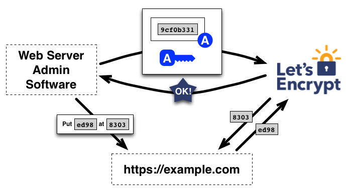

# Temat 3: Instalacja i aktualizacja certyfikatu Let’s Encrypt dla serwera WWW

Stanisław Nieradko 193044, Filip Dawidowski 193433, Bartłomiej Krawisz 193319, Krzysztof Nasuta 193328

---

# Czym jest Let's Encrypt?

> Let’s Encrypt to bezpłatny, automatyczny i wolny urząd certyfikacji (CA) działający dla pożytku publicznego. Jest to usługa dostarczana przez Internet Security Research Group (ISRG).
>
> Zapewniamy wszystkim osobom cyfrowe certyfikaty, których oczekują, aby umożliwić korzystanie stronom internetowym z HTTPS (SSL/TLS) całkowicie bezpłatnie i w jak najbardziej przyjazny dla użytkownika sposób. Czynimy to, ponieważ chcemy stworzyć bezpieczniejszy i szanujący prywatność Internet.
>
> Źródło: <cite>https://letsencrypt.org/pl/about/</cite>

|||

# Let’s Encrypt operuje:

- **Bezpłatnie**: Każdy właściciel domeny może użyć Let’s Encrypt do uzyskania zaufanego certyfikatu bez żadnych opłat.
- **Automatycznie**: Oprogramowanie działające na serwerze może bezproblemowo wchodzić w interakcję z Let’s Encrypt, aby uzyskać certyfikat, bezpiecznie skonfigurować go do użytku oraz automatycznie zająć się odnowieniem. 
- **Bezpiecznie**: Let’s Encrypt spełnia funkcję platformy do doskonalenia najlepszych praktyk zabezpieczeń TLS, zarówno po stronie CA, jak i pomagając operatorom witryn poprawnie zabezpieczyć swoje serwery.
- **Otwarcie**: Wszystkie wydane lub cofnięte certyfikaty będą publicznie rejestrowane i dostępne dla każdego do wglądu.
- **Wolnie**: Protokół automatycznego wydawania oraz odnawiania jest opublikowany jako wolny standard, który każdy może zastosować.
- **Wspólnie**: Tak jak podstawowe protokoły internetowe, Let’s Encrypt to wspólny wysiłek na rzecz społeczności pozostający poza kontrolną jakiejkolwiek organizacji.

|||

---

# Czy jest to rozwiązanie doskonałe?

 <!-- .element: class="fragment" data-fragment-index="1" -->

|||

# Co wybrać?

 <!-- .element: class="fragment fade-in" data-fragment-index="1" -->

## Let's Encrypt

- Darmowe certyfikaty (90 dni)
- Automatyczne odnawianie (certbot, caddy i inne narzędzia)
- Wsparcie dla wildcardów (tylko DNS-01)
- Duża społeczność i wsparcie

 <!-- .element: class="fragment fade-in" data-fragment-index="2" -->

## Płatne certyfikaty

- Dłuższy termin ważności (do 2 lat, chociaż niektóre przeglądarki ograniczają do 1 roku)
- Możliwość wykupienia certyfikatów Organizational Validation (OV) i Extended Validation (EV)
- Wsparcie techniczne

 

 <!-- .element: class="fragment fade-in" data-fragment-index="3" -->

## ZeroSSL

- Zarówno darmowe, jak i płatne certyfikaty
- Pełna konsola oraz REST API do zarządzania certyfikatami
- Monitorowanie certyfikatów SSL

 <!-- .element: class="fragment fade-in" data-fragment-index="4" -->

## Cloudflare

- Zarówno darmowe, jak i płatne certyfikaty (większe możliwości konfiguracji szyfrowania oraz wielopoziomowe domeny)
- Zintegrowane z usługami Cloudflare (popularny CDN, firewall i inne usługi)
- Łatwa i natychmiastowa konfiguracja dla użytkowników Cloudflare'a

|||

# Wróćmy do bohatera tej prezentacji

---

## Autoryzacja domeny

- Przy generowaniu certyfikatu Let's Encrypt wymagane jest potwierdzenie, że domena, dla której certyfikat chcemy wygenerować, należy do nas. Możliwe jest to poprzez spełnienie jednego z warunków opisanych w standardzie ACME (Automated Certificate Management Environment). Obecnie wspierane są trzy metody autoryzacji.

| Identyfikator | `http-01` | `dns-01` | `tls-alpn-01` |
|---------------|-----------|----------|---------------|
| Adres IP      | ✔️       | ❌       | ✔️            |
| Nazwa hosta   | ✔️       | ✔️       | ✔️            |

- Obecnie najczęściej stosowanymi metodami są `http-01` oraz `dns-01`.

- Do generowania certyfikatów **Let's Encrypt** można często używa się narzędzia **Certbot**. Jest to narzędzie, które automatyzuje proces generowania certyfikatów, a także ich odnawiania. Certbot wspiera zarówno autoryzację `http-01`, jak i `dns-01`.

|||

## HTTP-01 challenge

- Metoda ta jest obecnie najczęściej stosowaną metodą autoryzacji. Polega na umieszczeniu **pliku z wygenerowanym przez Let's Encrypt kodem** w odpowiednim katalogu **na serwerze**, który jest dostępny z zewnątrz.

- Let's Encrypt sprawdza, czy plik jest dostępny pod adresem `http://<TWOJA_DOMENA>/.well-known/acme-challenge/<TOKEN>`. Jeśli serwer WWW zwróci odpowiedni kod, jest to potwierdzenie, że domena należy do osoby, która chce wygenerować certyfikat.

- Metoda `HTTP-01` wymaga użycia **portu 80** na serwerze, na którym chcemy wygenerować certyfikat.

- Metoda ta jest **prosta w implementacji oraz szybka**, gdyż nie wymaga żadnych dodatkowych konfiguracji DNS. Potrzebujemy jednak dostępu do serwera HTTP obsługującego naszą domenę.

- Metody tej **nie można** użyć, aby wygenerować certyfikat **wildcard**. W przypadku kilku serwerów, każdy z nich musi zwracać ten sam kod.

|||

## DNS-01 challenge

- Metoda ta polega na **dodaniu rekordu TXT** do DNS domeny, dla której chcemy wygenerować certyfikat. Rekord ten zawiera, podobnie jak w przypadku `HTTP-01`, **wygenerowany przez Let's Encrypt kod**.

- Let's Encrypt sprawdza, czy rekord TXT `_acme-challenge.<TWOJA_DOMENA>` zawiera odpowiedni kod. Jeśli tak jest, mamy potwierdzenie, że domena należy do osoby, która chce wygenerować certyfikat.

- Metoda `DNS-01` wymaga dostępu do **konfiguracji DNS** domeny, dla której chcemy wygenerować certyfikat. Utrudnia to automatyzację procesu generowania certyfikatów. Dostawca DNS musi udostępniać odpowiednie **API**. Zalecane jest używanie uwierzytelniania API o ograniczonych uprawnieniach bądź walidacja DNS z osobnego serwera, a następnie skopiowanie certyfikatu na serwer.

- Metoda ta jest wolniejsza od `HTTP-01`, gdyż wymaga **czasu propagacji rekordów DNS**. Jest to jednak jedyna metoda, która **pozwala** na generowanie certyfikatów **wildcard**. W przypadku kilku serwerów, wystarczy jedna konfiguracja DNS.

|||

## TLS-SNI-01 challenge

- Metoda `TLS-SNI-01` została wycofana z użycia w 2019 roku z powodu niewystarczającego poziomu bezpieczeństwa.

|||

## LS-ALPN-01 challenge

- Zastąpiła ją metoda `TLS-ALPN-01`, która polega na **dodaniu rekordu TLS** do DNS domeny, dla której chcemy wygenerować certyfikat. Rekord ten zawiera, podobnie jak w przypadku `HTTP-01`, **wygenerowany przez Let's Encrypt kod**.

- Metoda ta jest rzadko stosowana. Nie jest obsługiwana przez Apache, Nginx ani Certbot. Jednym z nielicznych narzędzi, które wspierają tę metodę, jest Caddy.

- Zaletą tej metody jest brak konieczności dostępu do portu 80. Cały proces odbywa się na warstwie TLS.

- Metoda ta, podobnie jak `HTTP-01`, **nie pozwala** na generowanie certyfikatów **wildcard**. W przypadku kilku serwerów, każdy z nich musi zwracać ten sam kod.

---

## Wspierane sposoby instalacji certyfikatu Let's Encrypt

|||

## Manualna

|||

## Certbot

- **Certbot** to prosty w użyciu program, który automatyzuje proces uzyskiwania certyfikatów Let's Encrypt. Automatycznie konfiguruje serwer WWW (np. apache, nginx), aby używał nowego certyfikatu, a także automatycznie odnawia certyfikaty, gdy zbliżają się do wygaśnięcia. Certbot wspiera autoryzację `http-01` oraz `dns-01`.
|||

# Caddy

**Caddy** to serwer WWW z automatycznym generowaniem certyfikatów **Let's Encrypt**.

|||

## Dostawcy Hostingu

- Wiele firm hostingowych oferuje integrację z Let's Encrypt. W takim przypadku proces generowania certyfikatu jest zautomatyzowany, a użytkownik nie musi się martwić o konfigurację serwera WWW.

- Poniżej przedstawiamy przykładową konfigurację certyfikatu Let's Encrypt u jednego z dostawców hostingowych.

 

- Włączamy obsługę SSL dla naszej domeny.

- Następnie dodajemy symboliczne dowiązanie katalogu `private_html` do katalogu `public_html`.

- Następnie wybieramy certyfikat Let's Encrypt.

- Następnie możemy wybrać, dla których domen chcemy wygenerować certyfikat.
 
 <!-- .element: class="fragment fade-in" data-fragment-index="2" -->

---

# Środowiska

Certyfikatów Let's Encrypt można używać zarówno w środowiskach produkcyjnych, jak i testowych. W zależności od środowiska, różnią się one pewnymi parametrami.

 
 

  <!-- .element: class="fragment fade-in" data-fragment-index="1" -->

## Staging

- Certyfikaty wystawione w środowisku testowym są podpisane przez inny certyfikat root, co sprawia, że nie są one uznawane przez przeglądarki internetowe.

- Wystawianie certyfikatów w tym środowisku podlega niższym limitom, co pozwala na testowanie automatyzacji procesu wystawiania certyfikatów, bez dużego ryzyka zablokowania dostępu do usługi Let's Encrypt z powodu przekroczenia ograniczeń.

- W przypadku użycia certbot, aby wygenerować certyfikat staging wystarczy dodać flagę  `--staging`.

  <!-- .element: class="fragment fade-in" data-fragment-index="2" -->

## Prod

- Środowisko produkcyjne to środowisko aplikacji dla użytkowników końcowych. Certyfikaty wystawione w tym środowisku są uznawane przez przeglądarki internetowe.

- Wystawianie certyfikatów w środowisku produkcyjnym podlega limitom nałożonym przez organizację Let's Encrypt takimi jak ilość certyfikatów na zarejestrowaną domenę lub ilość zamówień certyfikatów na godzinę. W przypadku przekroczenia limitów, dostęp do usługi może zostać zablokowany na określony czas.

- Certbot domyślnie generuje certyfikaty w środowisku produkcyjnym.

---

## Czas na praktykę!

|||

## Instalacja na serwerze NGINX (Linux) z certbot'em

|||

## Instalacja w firmie hostingowej

---

## Dziękujemy za uwagę!
